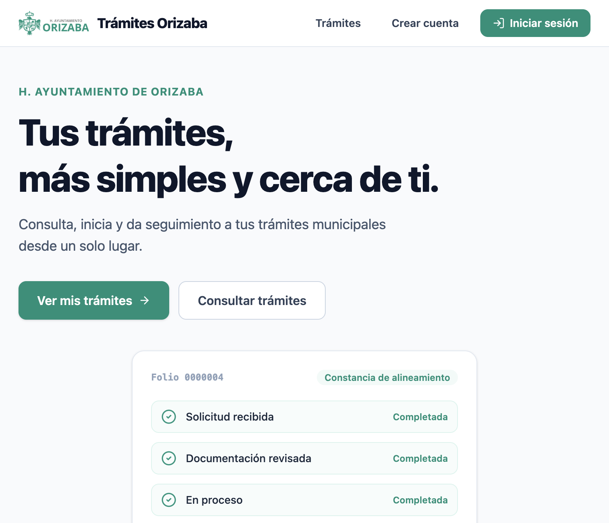

# 01 — Acceso y entornos

## Entornos

| Entorno | Propósito | Uso |
|---|---|---|
| **STAGING** | Pruebas funcionales, validación de flujos | **Este manual** |
| PROD | Producción real | **PROHIBIDO para pruebas** |

> ⚠️ **STAGING NO es PROD.** No documentamos ni accedemos a PROD en este manual.

## URLs STAGING

| Portal | URL |
|---|---|
| Portal ciudadano | `https://adm-web-citizens-staging.fly.dev` |
| Portal funcionarios | `https://adm-web-staging.fly.dev/funcionario/inicio` |
| Caja municipal | `https://adm-caja-staging.fly.dev` |

## Acceso ciudadano

1. Abrir `https://adm-web-citizens-staging.fly.dev`.
2. Pulsar **"Iniciar sesión"** (o **"Ver mis trámites"**).
3. El sistema redirige a la página segura de acceso (Cognito).
4. Ingresar **usuario (CURP)** y **contraseña** de la cuenta DEMO entregada por el responsable.
5. Pulsar **"Sign in"**.
6. Resultado esperado: acceso al **Portal Ciudadano** con el nombre del ciudadano demo y su CURP enmascarada.



> Nota: las credenciales se entregan por un canal separado; nunca están en este repositorio.

## Acceso funcionario

1. Abrir `https://adm-web-staging.fly.dev/funcionario/inicio`.
2. Ingresar la **CURP** de la cuenta funcionario DEMO.
3. Pulsar **Continuar**.
4. Se redirige al acceso seguro; ingresar la **contraseña** DEMO.
5. Resultado esperado: **Portal Funcionarios** con el rol correspondiente (Administrator, Capturist, Viewer, Cashier o KitDelivery).


## Acceso caja

1. Abrir `https://adm-caja-staging.fly.dev`.
2. Pulsar **INICIAR SESIÓN**.
3. Se redirige al acceso seguro; ingresar las credenciales DEMO de cajero.
4. Resultado esperado: pantalla de **CAJA MUNICIPAL** con **TURNO ABIERTO**.


## Comprobación rápida de salud

Antes de iniciar pruebas, verificar que todos los servicios respondan `200` en `/health`:

```
https://adm-tramites-staging.fly.dev/health
https://adm-web-staging.fly.dev/health
https://adm-web-citizens-staging.fly.dev/health
https://adm-pagos-staging.fly.dev/health
https://adm-caja-staging.fly.dev/health
https://adm-notificaciones-staging.fly.dev/health
https://adm-expediente-staging.fly.dev/health
https://adm-identidad-staging.fly.dev/health
https://adm-persona-staging.fly.dev/health
https://adm-api-curp-staging.fly.dev/health
https://adm-catastro-staging.fly.dev/health
```
