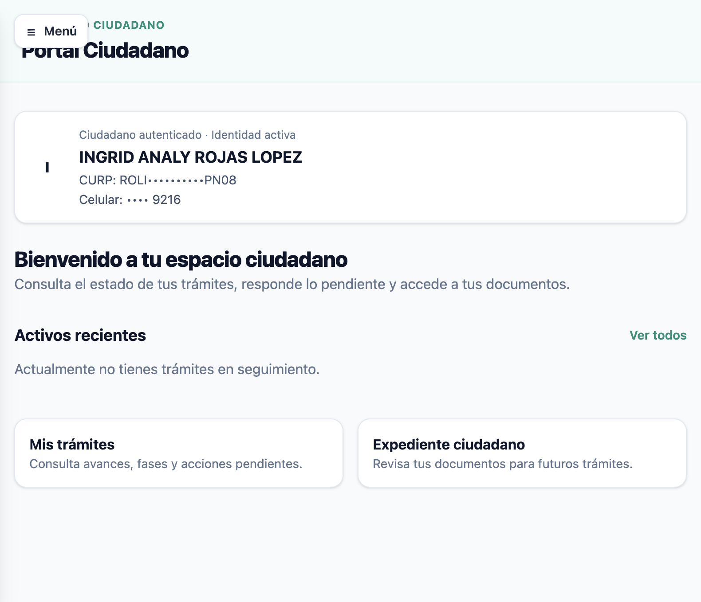
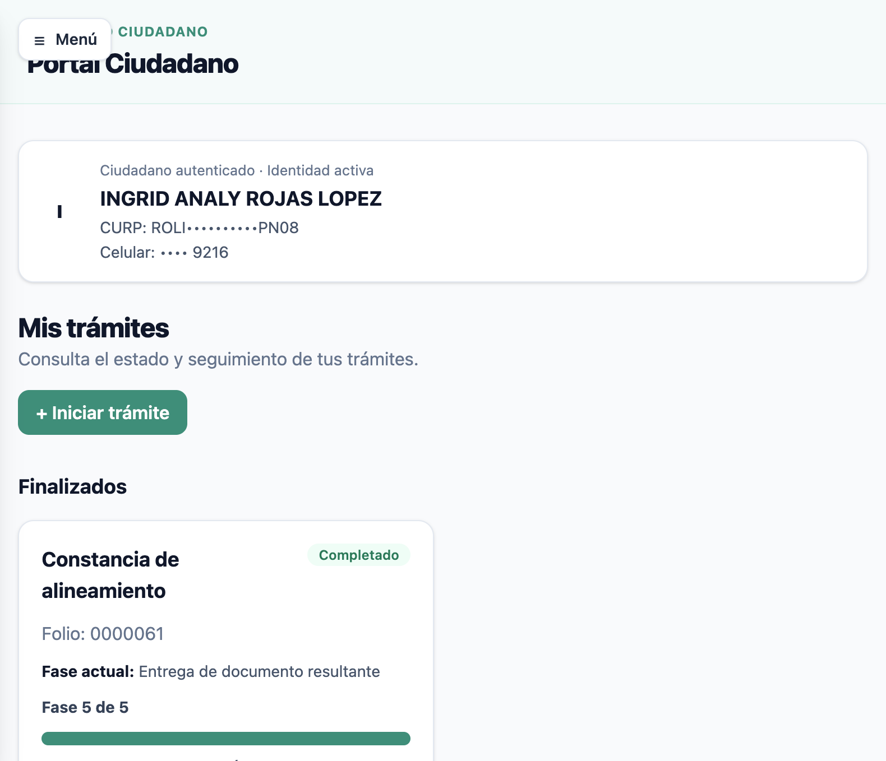
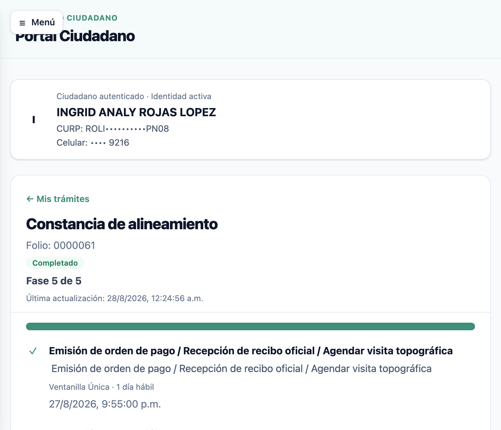
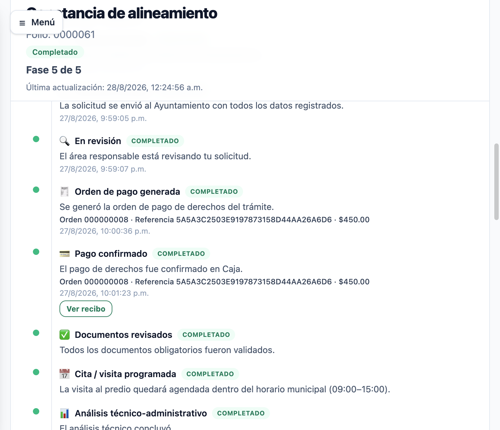
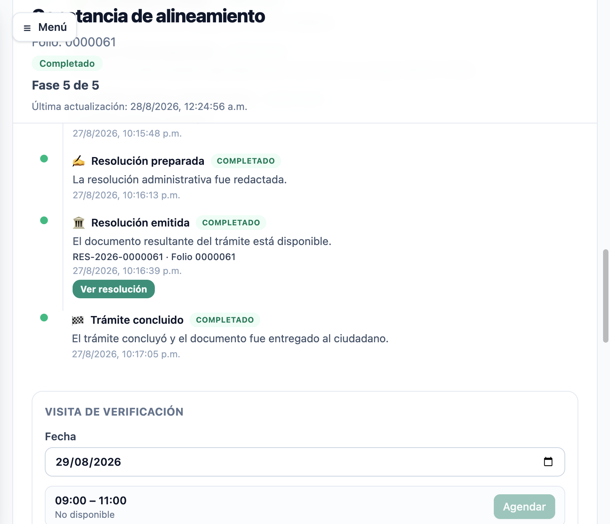

# 03 — Flujo ciudadano

Recorrido completo del **Portal Ciudadano** de STAGING.

---

## CIU-01 — Acceso

- **OBJETIVO**: entrar al portal ciudadano.
- **PRECONDICIÓN**: contar con cuenta DEMO ciudadana (entregada por el responsable).
- **PASOS**:
  1. Abrir `https://adm-web-citizens-staging.fly.dev`.
  2. Pulsar **"Iniciar sesión"**.
  3. En la página segura, ingresar usuario (CURP) y contraseña DEMO.
  4. Pulsar **Sign in**.
- **RESULTADO ESPERADO**: acceso al Portal Ciudadano con identidad activa.
- **QUÉ VALIDAR**: nombre del ciudadano demo, CURP enmascarada (p. ej. `ROLI••••••••••PN08`).
- **QUÉ NO DEBE OCURRIR**: errores de autenticación, mensajes de sesión inválida.


---

## CIU-02 — Inicio

- **OBJETIVO**: ver el resumen del espacio ciudadano.
- **PRECONDICIÓN**: sesión iniciada.
- **PASOS**: tras el login, se muestra "Mi espacio ciudadano".
- **RESULTADO ESPERADO**: tarjeta de identidad + accesos a "Mis trámites" y "Expediente ciudadano".
- **QUÉ VALIDAR**: datos de identidad correctos; menú con Inicio / Mis trámites / Expediente / Mi perfil.



---

## CIU-03 — Mis trámites

- **OBJETIVO**: consultar el listado de trámites.
- **PRECONDICIÓN**: sesión iniciada; al menos un trámite en el listado.
- **PASOS**:
  1. Menú → **Mis trámites** (o `…/portal/tramites`).
  2. Observar el listado.
- **RESULTADO ESPERADO**: trámite(s) del ciudadano con folio, estado y progreso (p. ej. **Folio 0000061 · Completado · Fase 5 de 5**).
- **QUÉ VALIDAR**: folio, estado, fase actual, fecha de última actualización, enlace "Ver seguimiento".



---

## CIU-04 — Seguimiento

- **OBJETIVO**: ver el detalle y timeline del trámite.
- **PRECONDICIÓN**: trámite con seguimiento disponible.
- **PASOS**:
  1. Pulsar **"Ver seguimiento"** del trámite.
  2. Revisar fases y actividad.
- **RESULTADO ESPERADO**: timeline con las fases del trámite (5/5) y la actividad (solicitud, envío, revisión, pago, resolución, concluido).
- **QUÉ VALIDAR**: fases completadas con fechas; actividad del trámite con eventos y marcas de tiempo.



---

## CIU-05 — Pago

- **OBJETIVO**: validar orden de pago y recibo.
- **PRECONDICIÓN**: trámite con orden de pago generada.
- **PASOS**:
  1. En la actividad del trámite, localizar **"Orden de pago generada"** y **"Pago confirmado"**.
  2. Pulsar **"Ver recibo"**.
- **RESULTADO ESPERADO**: orden con número, referencia y monto (p. ej. Orden 000000008 · $450.00); recibo descargable.
- **QUÉ VALIDAR**: número de orden, referencia, importe, estado Pagado, disponibilidad del recibo.



---

## CIU-06 — Resolución

- **OBJETIVO**: validar resolución emitida.
- **PRECONDICIÓN**: trámite resuelto.
- **PASOS**:
  1. En la actividad, localizar **"Resolución emitida"**.
  2. Pulsar **"Ver resolución"**.
- **RESULTADO ESPERADO**: número de resolución (p. ej. RES-2026-0000061) y documento disponible.
- **QUÉ VALIDAR**: número de resolución, estado emitida, documento descargable.



---

## CIU-07 — Expediente

- **OBJETIVO**: consultar el expediente ciudadano.
- **PRECONDICIÓN**: sesión iniciada.
- **PASOS**:
  1. Menú → **Expediente ciudadano** (o `…/portal/expediente`).
  2. Revisar los documentos del expediente.
- **RESULTADO ESPERADO**: documentos cargados (p. ej. INE frente/reverso, CURP) con estado "Cargado" y botón "Ver"; documentos faltantes con estado "No cargado".
- **QUÉ VALIDAR**: aislamiento (solo documentos del propio ciudadano), estados de documento.


---

## Referencia del trámite DEMO validado

```
Folio demo: 0000061
Estado: Completado
Fases: 5/5
Pago: Pagado (Orden 000000008 · $450.00)
Resolución: emitida (RES-2026-0000061)
Notificaciones: despachadas
```

> Este trámite es el caso de referencia funcional en STAGING. No modificar su registro.
