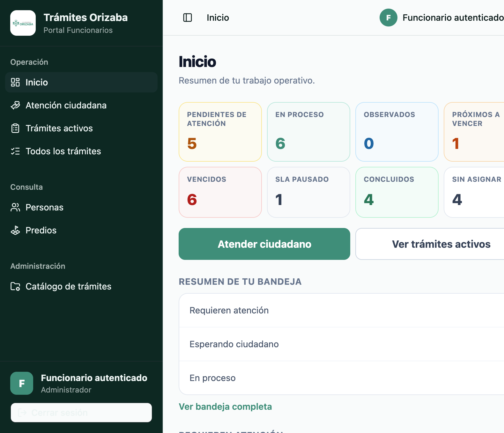
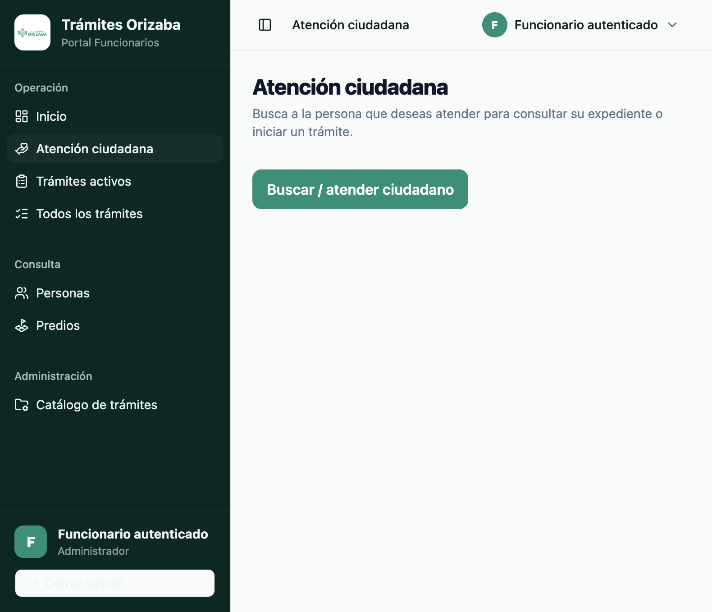
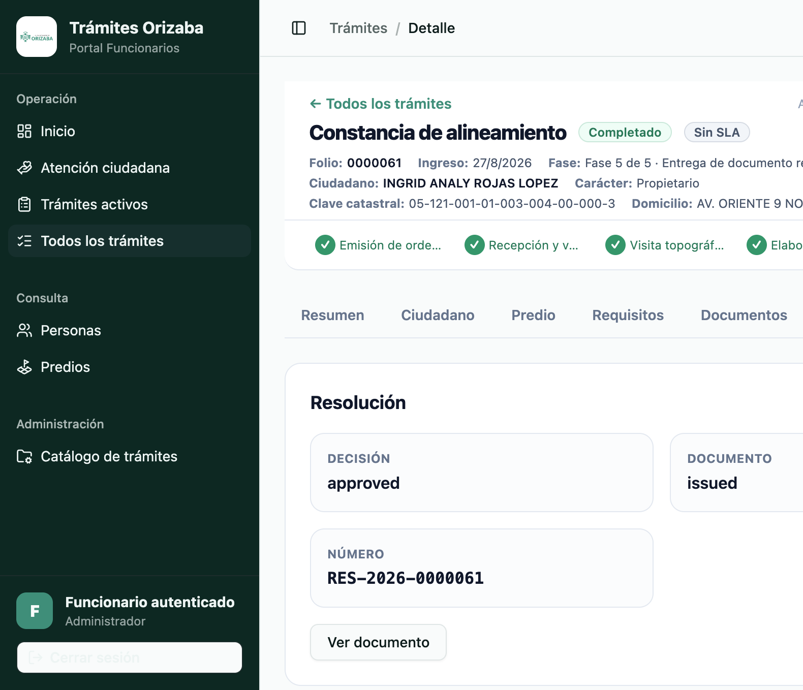
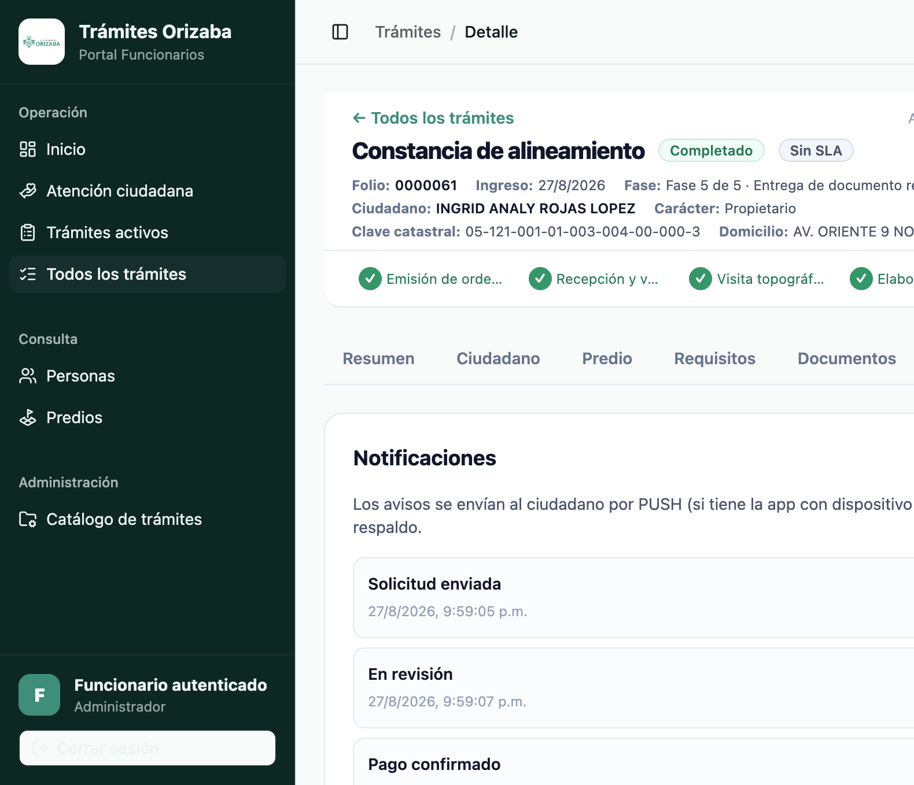

# 04 — Flujo funcionario

Recorrido del **Portal Funcionarios** de STAGING (perfil Administrator de referencia).

---

## FUN-01 — Login Workforce

- **OBJETIVO**: acceder al portal funcionario.
- **PRECONDICIÓN**: cuenta DEMO funcionario.
- **PASOS**:
  1. Abrir `https://adm-web-staging.fly.dev/funcionario/inicio`.
  2. Ingresar la **CURP** de la cuenta funcionario DEMO.
  3. Pulsar **Continuar** → se redirige al acceso seguro → ingresar contraseña.
- **RESULTADO ESPERADO**: Portal Funcionarios con el rol (p. ej. **Administrador**).

---

## FUN-02 — Inicio / bandeja

- **OBJETIVO**: ver la bandeja de atención ciudadana.
- **PASOS**: tras el login se muestra **Atención ciudadana**.
- **RESULTADO ESPERADO**: menú de operación (Inicio, Atención, Trámites activos, Todos los trámites), consulta (Personas, Predios) y administración (Catálogo); botón **"Buscar / atender ciudadano"**.

---

## FUN-03 — Consultar trámite

- **OBJETIVO**: abrir el detalle de un trámite.
- **PASOS**:
  1. Ir a **Todos los trámites** (o usar la URL directa del detalle).
  2. Abrir el trámite (p. ej. folio 0000061).
- **RESULTADO ESPERADO**: cabecera con folio, ingreso, fase, ciudadano, carácter, clave catastral y domicilio; progreso por fases (5/5).

---

## FUN-04 — Datos ciudadano

- **PASOS**: pestaña **Ciudadano** del detalle.
- **RESULTADO ESPERADO**: datos de la persona (nombre, CURP enmascarada) asociados al trámite.

---

## FUN-05 — Predio / carácter

- **PASOS**: pestaña **Predio**.
- **RESULTADO ESPERADO**: datos del predio (clave catastral, domicilio) y carácter (Propietario/Representante/Gestor/Poseedor).

---

## FUN-06 — Requisitos

- **PASOS**: pestaña **Requisitos**.
- **RESULTADO ESPERADO**: listado de requisitos del trámite y su estado.

---

## FUN-07 — Documentos

- **OBJETIVO**: validar los documentos del expediente.
- **PASOS**: pestaña **Documentos**.
- **RESULTADO ESPERADO**: documentos con estado **VALIDADO** y botón **"Ver documento"** (p. ej. Credencial de elector frente/reverso, Escrituras, Fotografía de fachada, Croquis, Contribuciones, Formato de solicitud).
- **QUÉ VALIDAR**: estado de cada documento, fechas de validación, acceso al documento.

---

## FUN-08 — Pago

- **OBJETIVO**: validar la orden de pago desde el trámite.
- **PASOS**: pestaña **Pago**.
- **RESULTADO ESPERADO**: estado **Pagado**, orden (000000008), referencia, importe ($450.00) y fecha de pago.

---

## FUN-09 — Citas

- **PASOS**: pestaña **Citas / visitas**.
- **RESULTADO ESPERADO**: cita/visita agendada dentro del horario municipal (09:00–15:00) y slots disponibles.

---

## FUN-10 — Resolución

- **PASOS**: pestaña **Resolución**.
- **RESULTADO ESPERADO**: decisión **approved**, documento **issued**, número **RES-2026-0000061** y botón **"Ver documento"**.

---

## FUN-11 — Historial

- **PASOS**: pestaña **Historial**.
- **RESULTADO ESPERADO**: actividad cronológica del trámite (solicitud, revisión, pago, cita, análisis, resolución, conclusión).

---

## FUN-12 — Notificaciones

- **PASOS**: pestaña **Notificaciones**.
- **RESULTADO ESPERADO**: avisos despachados al ciudadano (solicitud enviada, en revisión, pago confirmado, resolución emitida, trámite concluido) con marcas de tiempo.

---

## Nota

Estas pruebas se realizan sobre el **trámite DEMO ya completado** (folio 0000061). No se
realizan cambios destructivos; la validación es de **consulta y lectura**.
