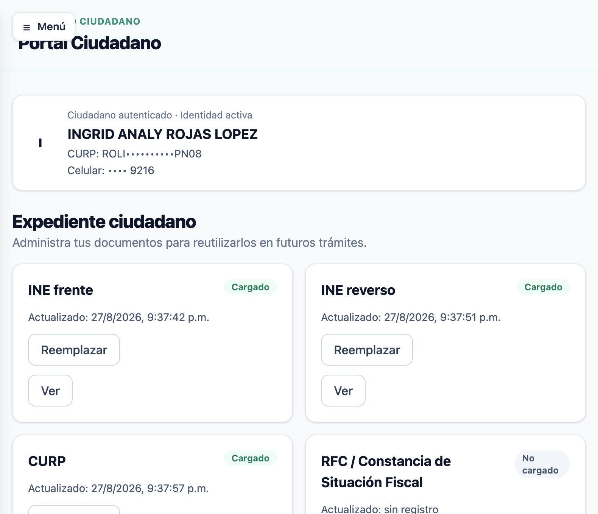

# 05 — Expediente

## ¿Qué es el expediente ciudadano?

El **expediente ciudadano** es el repositorio documental del ciudadano en STAGING. Los
documentos cargados (INE, CURP, comprobantes, etc.) se reutilizan en futuros trámites.

## ¿Quién lo ve y qué ve?

| Actor | Qué ve |
|---|---|
| **Ciudadano** | Solo sus propios documentos (INE frente/reverso, CURP, RFC, comprobante de domicilio, etc.) con estado **Cargado** / **No cargado** y botones **Ver** / **Reemplazar** / **Cargar** |
| **Funcionario** | Los documentos del trámite en atención con estado de **validación** (p. ej. **VALIDADO**) |

## Estados de documento

| Estado | Significado |
|---|---|
| `Cargado` | El ciudadano subió el documento; disponible para "Ver" |
| `No cargado` | El documento no se ha subido (botón "Cargar") |
| `Validado` | El funcionario validó el documento (flujo de revisión documental) |

## Validación documental (funcionario)

En el detalle del trámite (pestaña **Documentos**), los documentos aparecen con estado
**VALIDADO**, versión, fecha y botón **"Ver documento"**.

## Aislamiento

- El ciudadano **solo ve su propio expediente**.
- Un ciudadano **no puede ver el expediente de otro** (ver [08-seguridad-y-permisos.md](08-seguridad-y-permisos.md)).
- El funcionario ve los documentos del trámite que está atendiendo.

## Screenshots

> Los documentos de prueba pertenecen a personas sintéticas DEMO; no contienen PII real.
