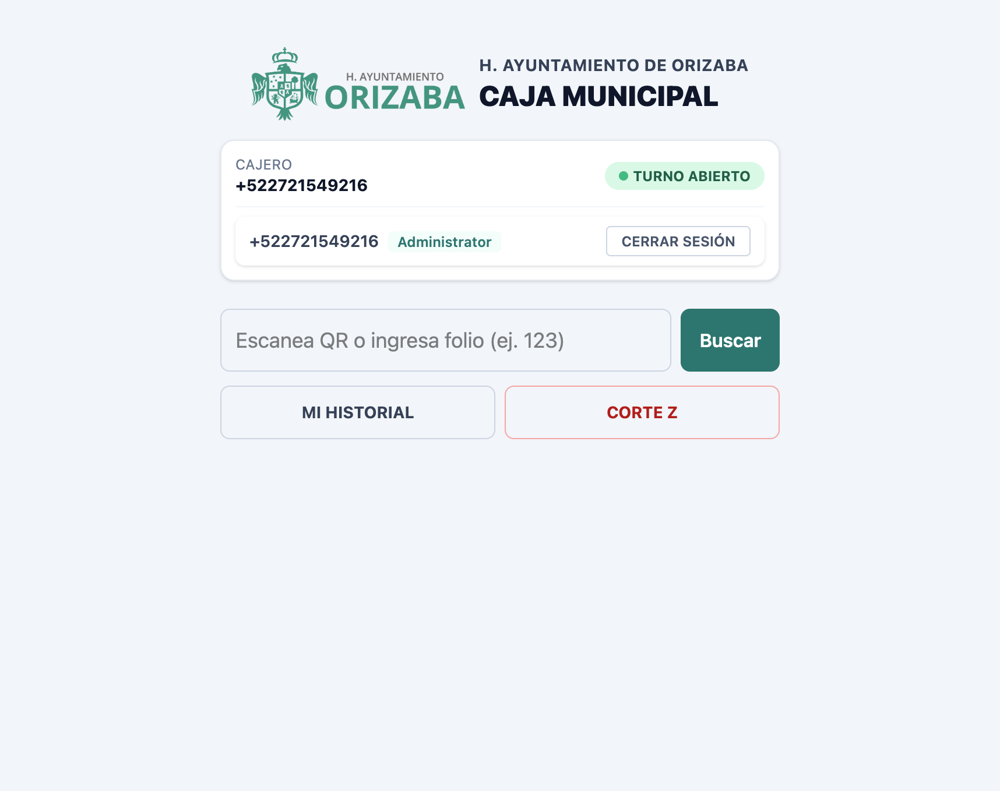
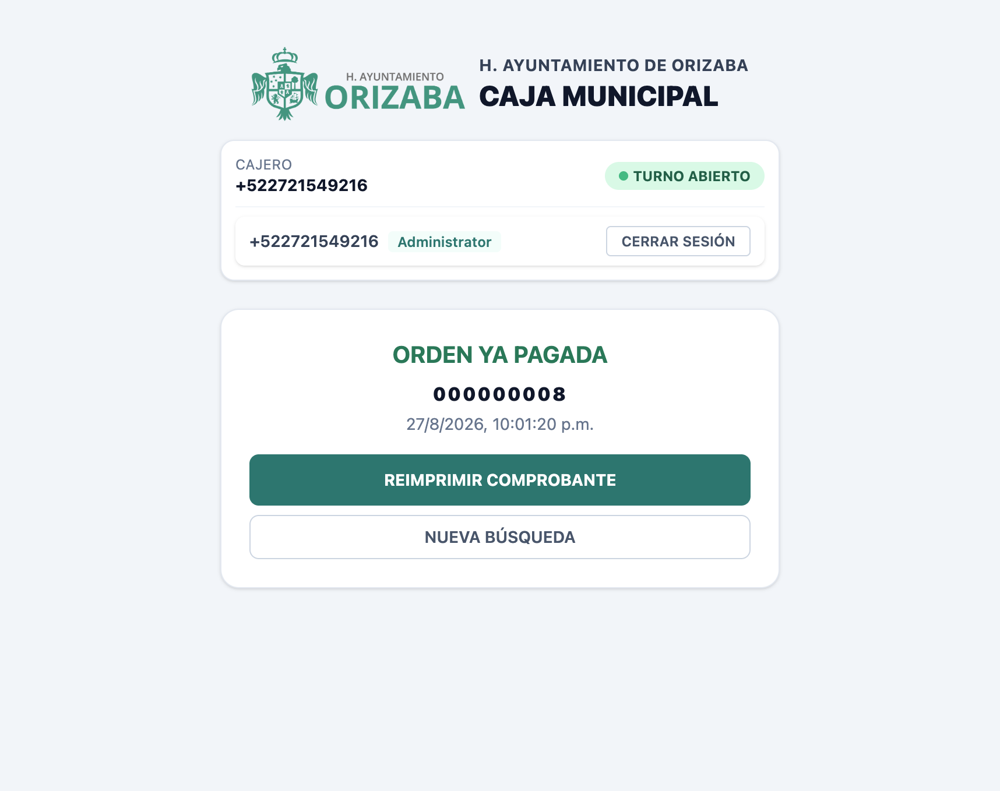
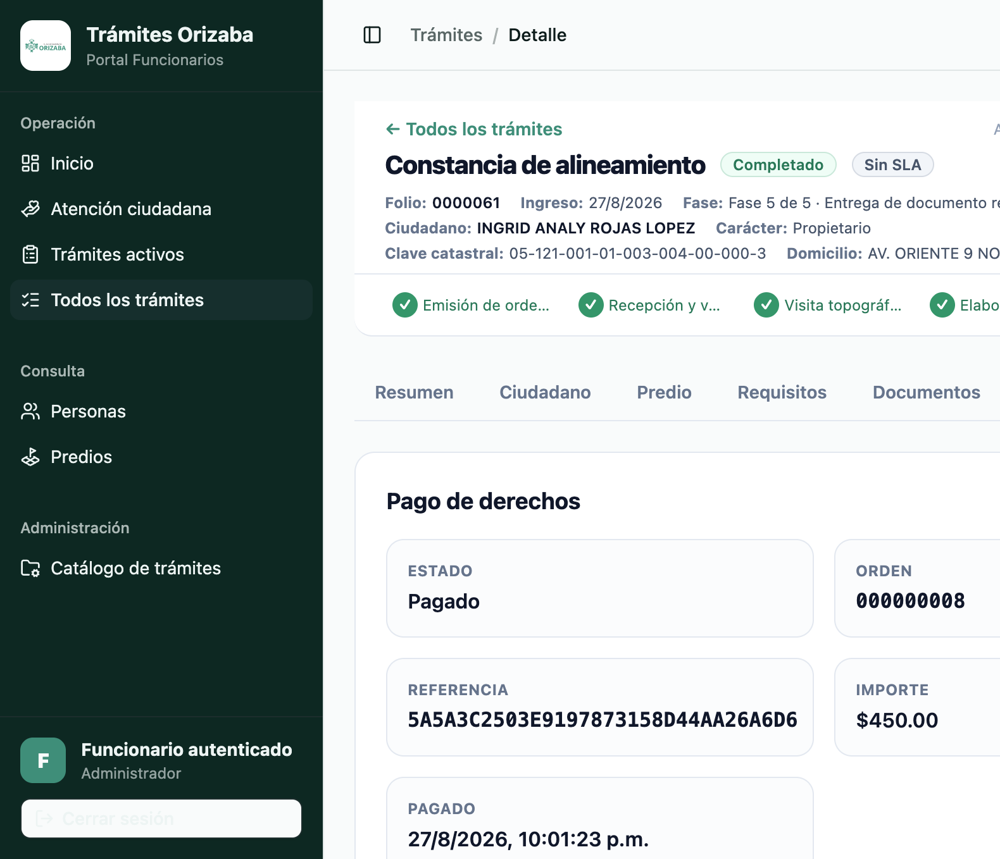

# 06 — Pagos y caja

## Ciclo del pago

```
generación de orden (funcionario)
   ↓
consulta de orden (caja)
   ↓
estado PENDIENTE
   ↓
cobro en caja
   ↓
callback → estado PAGADO
   ↓
recibo disponible (ciudadano/funcionario)
   ↓
comprobante (caja)
```

## Generación de la orden

El funcionario genera la **orden de pago** de derechos del trámite (p. ej. Orden 000000008,
Referencia `5A5A3C…`, importe **$450.00**). El ciudadano la ve en la actividad del trámite
(**"Orden de pago generada"**).

## Estados de la orden

| Estado | Descripción |
|---|---|
| `Pending` | Orden emitida, aún no cobrada |
| `Paid` | Pago confirmado vía callback de caja |

## Consulta en caja

- **OBJETIVO**: localizar una orden por folio/QR.
- **PASOS** (en `https://adm-caja-staging.fly.dev`):
  1. Turno abierto (ver CAJ-02).
  2. Ingresar el folio de la orden (p. ej. `000000008`) o escanear el QR.
  3. Pulsar **Buscar**.
- **RESULTADO ESPERADO**: la orden y su estado.

## Cobro y callback

Al cobrar en caja, el sistema de pagos emite el **callback** hacia trámites, que actualiza la
orden a **Pagado** y deja disponible el **recibo**. No se realizan cobros reales en STAGING:
solo operaciones DEMO no destructivas.

## Recibo y comprobante

- El **ciudadano** puede pulsar **"Ver recibo"** en la actividad del trámite.
- La **caja** puede **reimprimir el comprobante** de una orden ya pagada.

---

## CAJ-01 — Login

- **PASOS**: abrir `https://adm-caja-staging.fly.dev` → **INICIAR SESIÓN** → credenciales DEMO de cajero.
- **RESULTADO ESPERADO**: pantalla de CAJA MUNICIPAL.



## CAJ-02 — Turno

- **PASOS**: tras el login, el sistema carga el **turno de caja**.
- **RESULTADO ESPERADO**: indicador **TURNO ABIERTO** con el cajero identificado.


## CAJ-03 — Buscar orden

- **PASOS**: ingresar folio de la orden (p. ej. `000000008`) → **Buscar**.
- **RESULTADO ESPERADO**: detalle de la orden.

## CAJ-04 — Orden pagada

- **RESULTADO ESPERADO**: mensaje **"ORDEN YA PAGADA"** con número de orden y fecha de pago.


## CAJ-05 — Reimpresión

- **PASOS**: pulsar **REIMPRIMIR COMPROBANTE**.
- **RESULTADO ESPERADO**: se genera/reimprime el comprobante de la orden pagada.

---

## Screenshots adicionales




> STAGING utiliza montos de demostración; no representa tarifas oficiales.
